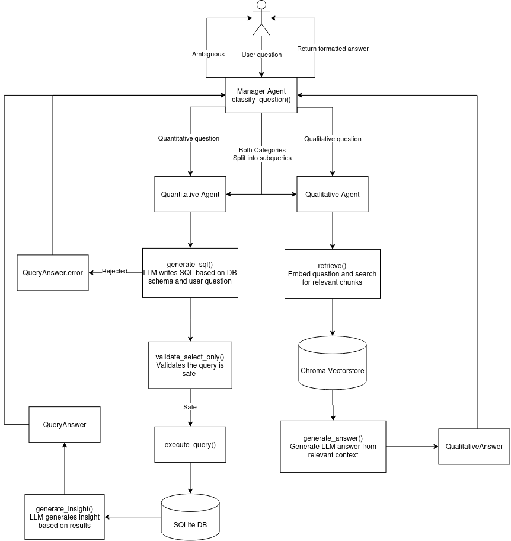

# Python Capstone: Multi-Agent RAG System for Enterprise Documentation

## System Overview

### Agent Roles

- Manager Agent
  - Ingests user queries and classifies into one of the follwong categories: qualitative, quantitative, both, ambiguous
  - Decides which agent to call based on classification
  - Receives responses from sub-agents and assembles the final response
- Qualitative Agent
  - Embeds the user query and retrieves relevant chunks from the Chroma vector DB
  - Generates a response to answer the user query based on the retrieved context with cited sources
  - Returns a formatted answer to the manager agent
- Quantitative Agent
  - Generates SQL queries based on user query and system prompt
  - Validates it is safe to run and executes agains tthe SQLite DB
  - Formats the data into a tabular response and calls the LLM to generate an insight based on the data
  - Returns the formatted data and insight to the maanger agent

### Architecture Diagram



## Setup & CLI Usage

### Prerequisites

- Python 3.14+
- [uv](https://docs.astral.sh/uv/) for dependency management
- A [Gemini API key](https://aistudio.google.com/apikey) (powers chat + embeddings)

### Setup

1. Install dependencies:

   ```bash
   uv sync
   ```

2. Copy the environment template and fill in your API keys:

   ```bash
   cp .env.example .env
   ```

   Edit `.env` and set `GEMINI_API_KEY` The other variables (model names, DB paths, log level) have sensible defaults but can be overridden.

3. Seed the SQLite database with synthetic sales data:

   ```bash
   uv run python data/seed_sql.py
   ```

   This creates `data/seed.db`.

4. Seed the Chroma vector store with the policy documents:

   ```bash
   uv run python -m python_capstone.seed_vectorstore
   ```

   This chunks the files in `data/policy_docs/` and embeds them into `chroma_db/`.

### Using Groq API Key Instead

If you are running into errors/limits with Gemini. You can create a free API key with [Groq](https://console.groq.com/keys).

To utilize the Groq api, set GROQ_API_KEY in .env and the LLM provider will automatically use Groq for API keys.

### Running the CLI

```bash
uv run python-capstone
```

This runs the CLI

```
Demonbreun Goods Assistant - Ask me anything! (type 'exit' to quit)

> What were total sales in the East region last quarter?
> What's our policy on remote work?
> How do our PTO policy and Q3 sales in the West region compare?
```

- Quantitative questions are answered from `data/seed.db` via generated SQL.
- Qualitative questions are answered from the policy docs via retrieval + citation.
- Questions the manager classifies as `both` are split into subqueries and answered by both agents.
- Ambiguous questions get a clarification prompt instead of a guess.
- Type `exit` or `quit` to leave the REPL.

### Logs

Logs are written via `logging_conf.py` and stored in 'src/python_capstone/logs.txt'

## Data

All data is synthetic, generated for a fictional company, "Demonbreun Goods."

### SQL DB data (SQLite — `data/seed.db`)

Generated by [data/seed_sql.py](data/seed_sql.py) into three tables:

- **`regions`** — 5 sales regions (Northeast, Southeast, Midwest, Southwest, West Coast)
- **`products`** — 10 products across Home & Garden, Apparel, and Accessories categories, each with a unit price
- **`sales`** — randomly generated line items (5-15 per day) spanning January 2023 through June 2024, each tied to a product and region with a quantity and revenue

### Vector DB data (Chroma vector store — `chroma_db/`)

Six company policy documents in [data/policy_docs/](data/policy_docs/), each a Markdown file with a document ID, effective date, and last-updated date:

- `security_policy.md` — Information Security Policy
- `code_review_process.md` — Engineering Code Review Process
- `customer_complaint_handling.md` — Customer Complaint Handling and Resolution Policy
- `employee_onboarding.md` — Employee Onboarding Policy
- `pto_policy.md` — Paid Time Off (PTO) Policy
- `remote_work_policy.md` — Remote and Hybrid Work Policy

These are chunked and embedded by [seed_vectorstore.py](src/python_capstone/seed_vectorstore.py) and back the qualitative agent's retrieval.

## Use Cases

Here are some examples showing the types of questions this system can answer

**Quantitative** (answered from `data/seed.db`):

- What were total sales in the Southeast region last quarter?
- Which product generated the most revenue in 2023?
- How many units of the Fleece Jacket have been sold in the Midwest?

**Qualitative** (answered from the policy docs):

- What's our policy on remote work?
- How many PTO days do employees accrue per year?
- What steps are required before a pull request can be merged?

**Both** (split into subqueries, answered by both agents):

- How do our PTO policy and Q3 sales in the West Coast region compare?
- Does our security policy say anything relevant to how we handle the Northeast region's declining sales?
